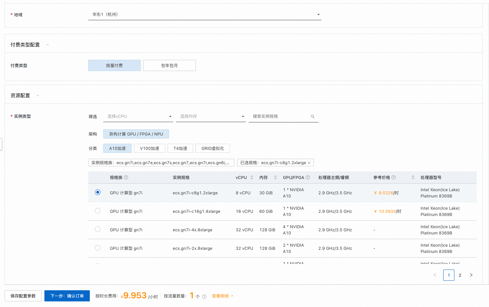
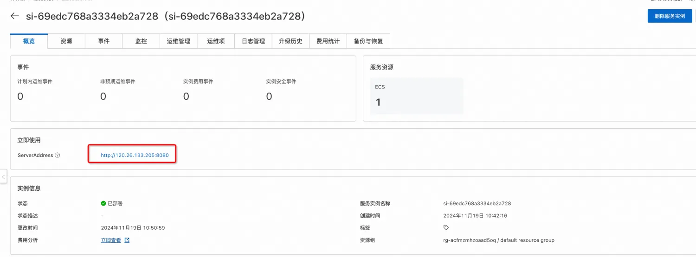

# Open WebUI 服务实例部署文档

## Open WebUI和Ollama介绍

Open WebUI 是一个功能丰富且用户友好的自托管 Web 用户界面（WebUI），它被设计用于与大型语言模型（LLMs）进行交互，特别是那些由 Ollama 或与 OpenAI API 兼容的服务所支持的模型。Open WebUI 提供了完全离线运行的能力，这意味着用户可以在没有互联网连接的情况下与模型进行对话，这对于数据隐私和安全敏感的应用场景尤为重要。
以下是 Open WebUI 的一些主要特点：
1. 直观的界面：Open WebUI 的界面受到 ChatGPT 的启发，提供了一个清晰且用户友好的聊天界面，使得与大型语言模型的交互变得直观。
2. 扩展性：这个平台是可扩展的，意味着可以通过添加新的插件或功能来定制和增强其能力，适应不同的使用场景和需求。
3. 离线操作：Open WebUI 支持完全离线运行，不依赖于网络连接，适合在任何设备上使用，无论是在飞机上还是在偏远地区。
4. 兼容性：它兼容多种 LLM 运行器，包括 Ollama 和 OpenAI 的 API，这使得用户可以从多个来源选择和运行不同的语言模型。
5. 自托管：用户可以在自己的服务器或设备上部署 Open WebUI，这为数据隐私和控制提供了更高的保障。
6. Markdown 和 LaTeX 支持：Open WebUI 提供了全面的 Markdown 和 LaTeX 功能，让用户可以生成富文本输出，这在科学和学术交流中非常有用。
7. 本地 RAG 集成：检索增强生成（RAG）功能允许模型利用本地存储的数据进行更深入和具体的回答，增强了聊天交互的功能。

Ollama 是一个开源项目，其主要目标是简化大型语言模型（LLMs）的部署和运行流程，使得用户能够在本地机器或私有服务器上轻松运行这些模型，而无需依赖云服务。以下是 Ollama 的一些主要特点和功能：
1. 简化部署： Ollama 设计了简化的过程来在 Docker 容器中部署 LLMs，这大大降低了管理和运行这些模型的复杂性，使得非专业人员也能部署和使用。
2. 捆绑模型组件： 它将模型的权重、配置和相关数据打包成一个被称为 Modelfile 的单元，这有助于优化模型的设置和配置细节，包括 GPU 的使用情况。
3. 支持多种模型： Ollama 支持一系列大型语言模型，包括但不限于 Llama 2、Code Llama、Mistral 和 Gemma 等。用户可以根据自己的具体需求选择和定制模型。
4. 跨平台支持： Ollama 支持 macOS 和 Linux 操作系统，Windows 平台的预览版也已经发布，这使得它在不同操作系统上的兼容性更好。
5. 命令行操作： 用户可以通过简单的命令行指令启动和运行大型语言模型。例如，运行 Gemma 2B 模型只需要执行 ollama run gemma:2b 这样的命令。
6. 自定义和扩展性： Ollama 的设计允许用户根据特定需求定制和创建自己的模型，这为模型的个性化使用提供了可能。

通过 Ollama，用户可以获得以下好处：
* 隐私保护：由于模型在本地运行，因此数据不需要上传到云端，从而保护了用户的隐私。
* 成本节约：避免了云服务的费用，尤其是对于大量请求的情况。
* 响应速度：本地部署可以减少延迟，提供更快的响应时间。
* 灵活性：用户可以自由选择和配置模型，以满足特定的应用需求。

Open WebUI和Ollama做了集成，可以轻松在web界面上管理大模型，支持在线下载，Ollama支持的模型可以在这里查看https://ollama.com/search

## 计费说明
Open WebUI面板在阿里云上的费用主要涉及：
* 所选GPU云服务器的规格
* 磁盘容量
* 公网带宽
计费方式：按量付费（小时）或包年包月
预估费用在创建实例时可实时看到。

## 部署架构

部署架构采用ECS(云服务器)单机部署

## RAM账号所需权限

| 权限策略名称                          | 备注                     |
|---------------------------------|------------------------|
| AliyunECSFullAccess             | 管理云服务器服务（ECS）的权限       |
| AliyunVPCFullAccess             | 管理专有网络（VPC）的权限         |
| AliyunROSFullAccess             | 管理资源编排服务（ROS）的权限       |
| AliyunComputeNestUserFullAccess | 管理计算巢服务（ComputeNest）的用户侧权限 |

## 部署流程

### 部署步骤

1. 单击部署链接，进入服务实例部署界面，根据界面提示，填写参数完成部署。
2. 参数填写完成后可以看到对应询价明细，确认参数后点击**下一步：确认订单**

3. 确认订单完成后同意服务协议并点击**立即创建**
4. 等待部署完成后就可以开始使用服务，进入服务实例详情点击Address访问。

